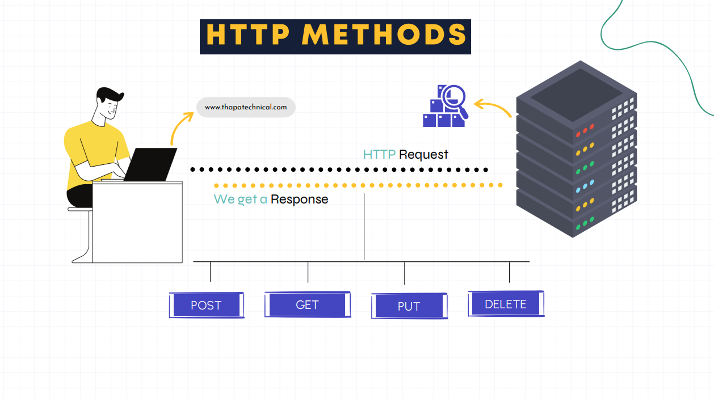
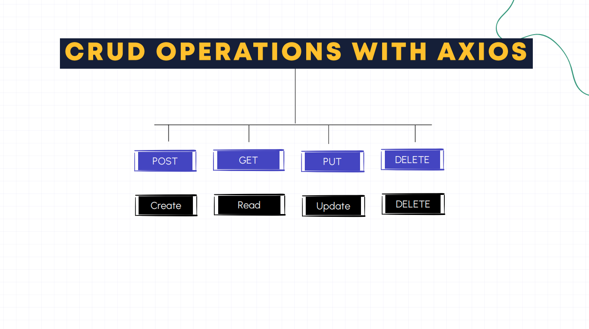

# Axios Study Guide

# Folder Structure Diagram


---

## 1. What is Axios?

Axios is a promise-based HTTP library that helps you easily communicate with servers or APIs over the internet. It allows your website or app to send and receive data from a server, like fetching information, submitting forms, or updating content without reloading the entire page.

Axios uses promises to handle HTTP requests and responses.

**Why Choose Axios over Fetch?**

- Easier syntax and cleaner code.
- Automatic JSON transformation without extra code.
- Better built-in error handling.
- Support for older browser

---

## 2. How to install Axios?

```
npm install axios
bun i axios
```

---

## 3. What is Request method aliases?

For convenience, aliases have been provided for all common request methods.

- axios.request(config)
- axios.get(url[, config])
- axios.delete(url[, config])
- axios.head(url[, config])
- axios.options(url[, config])
- axios.post(url[, data[, config]])
- axios.put(url[, data[, config]])
- axios.patch(url[, data[, config]])

---

## 4. How to create an instance of Axios?

We can create a new instance of axios with a custom config.

```
const instance = axios.create({
  baseURL: 'https://some-domain.com/api/',
  timeout: 1000,
  headers: {'X-Custom-Header': 'foobar'}
});
```

---

## 5. How to get data from API using axios?

[For Code Part...](./src/pages/Movie.jsx)

---

## 6. What is the professional way to work with API using axios?

[For Code Part...](./src/services/GetService.jsx)

---

## 7. What are the HTTP Methods?



---

## 8. CRUD Operations with Axios?



---

## 9. How to Delete Data?

1. [For Axios Instance Code Part...](./src/api/PostApi.jsx)

2. [For Code Part...](./src/pages/CRUDOperations.jsx)

---

## 10. How to Add Data?

1. [For Axios Instance Code Part...](./src/api/PostApi.jsx)

2. [For Code Part...](./src/components/UI/From.jsx)

---

## 11. How to Update Data?

1. [For Axios Instance Code Part...](./src/api/PostApi.jsx)

2. [For Code Part...](./src/pages/CRUDOperations.jsx)

3. [For Code Part...](./src/components/UI/From.jsx)

---
