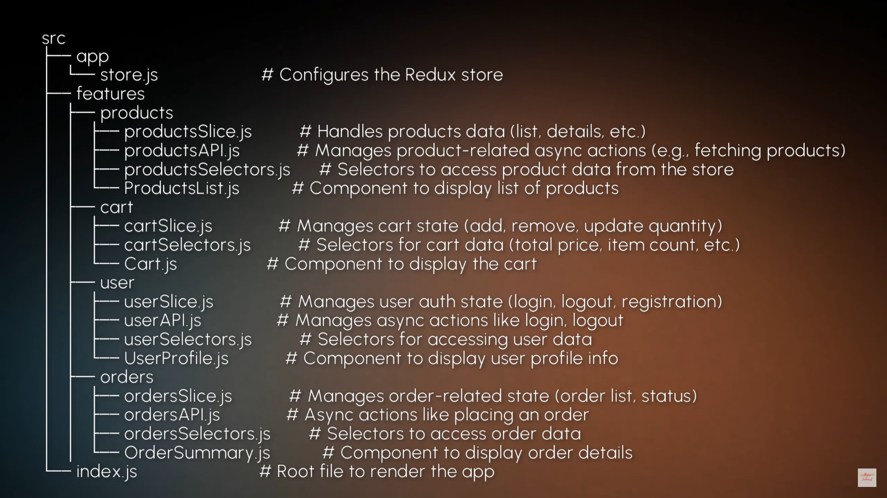

# Redux Toolkit Guide For Revision

# Table of Content

1. [What is Redux Toolkit](#1-what-is-redux-toolkit)
2. [Why Redux Toolkit & Advantages](#2-why-redux-toolkit--advantages-of-redux-toolkit)
3. [Immer](#3-what-is-immer)
4. [configureStore & useSelector](#4-how-to-create-or-configure-store--use-useselector-hook-in-rtk)
5. [createSlice](#5-what-is-createslice)
6. [Connect RTK with React](#6-how-to-connect-redux-toolkit-with-react)
7. [Access RTK State using useSelector](#7-access-rtk-state-in-react-using-useselector)
8. [Dispatch Action](#8-how-to-dispatch-actions)
9. [Folder Structure](#9-what-is-the-folder-structure-which-redux-or-rtk-tells--used-by-professionals)

---

## 1. What is Redux Toolkit?

Redux Toolkit (RTK) is an official toolset from the Redux team that makes working with Redux easier & less time-consuming.

Instead of doing everything manually-like creating actions, reducers, & managing state immutability-RTK gives us built-in functions that handle most of that work for us.

In simpler terms, it's a shortcut that helps us manage our app's state with less code & fewer mistakes. The goal is to make Redux more beginner-friendly & reduce the amount of code we need to write.

---

## 2. Why Redux Toolkit & Advantages of Redux Toolkit?

- **Less Boilerplate:** In traditional Redux, we write a lot of repetitive code just to get basic things done. RTK cuts down on all that extra code & gives us a cleaner, simpler way to manage state.

- **Simpler Setup:** It also automatically sets up our store, adds some middleware for things like async actions, & even connects us to Redux DevTools for debugging without extra configuration.

- **Built-in Async Handling:** If we're ever used Redux Thunk for async tasks like fetch data from an API. RTK has a built-in feature called `createAsyncThunk` that makes even easier to handle async actions.

**Advantages:**

- **Less Boiler Plate:** Normally with Redux, we need to write action types, action creators, & reducers separately. With RTK's `createSlice` we can handle all of this in one place, in fewer lines of code.

- **Easier to Work with State:** RTK uses a tool called `Immer` under the hood, which allows us to write state changes like we're mutating the state directly, but it still follows Redux's rule of immutability (not changing the original state).

- **Better Async Logic:** Handling async tasks, like fetching data, is much simpler with RTK's `createAsyncThunk`. It automatically handles loading, success, & error states for us, so we don't have to write all that manually.

- **Great Defaults:** RTK sets up Redux DevTools, middleware, & other configuration for us, so we can focus on building our app instead of setup.

**Syntax:**

```
import {createSlice} from '@reduxjs/toolkit;

const counterSlice = createSlice({
    name: 'counter',
    initialState: { value: 0 },
    reducers: {
        increment(state){
            state.value += 1; // But Immer handles immutability behind the scenes.
        },
    },
});

export const { increment } = counterSlice.actions;
export default counterSlice.reducers;
```

---

## 3. What is Immer?

Immer gives the superpower to Redux, where we can mutate the object but behind the scenes it create new object & allocate or make changes in it.

Immer matches the changes between original & duplicate object, & creates a new object. & than it changes the state.

---

## 4. How to create or configure store & use useSelector hook in RTK?

[For Code Part...](./src/store.jsx)

---

## 5. What is createSlice?

In Redux Toolkit (RTK), `createSlice` is a utility function that simplifies the process of creating a Redux slice of state. It combines actions & reducers into a single object, making the setup of Redux state management more streamlined & organized.

A slice is essentially a section of the Redux state, along with the actions & reducers that operate on it. Using `createSlice`, we can define.

- The `initial state` of the slice.
- `Reducers` that defines how the state changes in response to actions.
- `Action creators` automatically generated based on reducer names.

---

## 6. How to Connect Redux Toolkit with React?

To use Redux in a React app, we need to connect Redux's store & actions to React components. This allows components to access the global state & dispatch actions.

- **Step1:** To install react-redux

```
npm i react-redux

bun add react-redux
```

- **Step2:**
  - **Wrap the App with Provider:** Use the Provider component to pass the Redux store to the entire app.

[For Code Part...](./src/main.jsx)

---

## 7. Access RTK State in React using useSelector?

Use the useSelector hook to read data from the Redux store.

**Syntax:**

```
const count = useSelector((state)=>state.reducer.property);
```

**Selector function:** We define a selector function that takes the entire Redux store state as an argument & returns the specific piece of data we need.

[For Code Part...](./src/Pages/Todo.jsx)

---

## 8. How to Dispatch actions?

Use the useDispatch hook to dispatch actions from a React component.

```
dispatch(reducerFn(data));
```

[For Code Part...](./src/Pages/Todo.jsx)

---

## 9. What is the folder structure which Redux or RTK tells & used by professionals?

```
src
|-- app
|    |-- store.js // #Redux Store Configuration.
|--features
|   |--tasks
|       |-- tasksSlice.js // #The Tasks slice
|       |-- tasksActions.js // #Action creators (optional if needed separately)
|       |-- tasksSelectors.js // #Selectors (if you have complex selectors)
|       |-- tasksAPI.js // #Async API Calls (if using RTK Query or other async log)
|--index.js // # Root entry file
```



---
