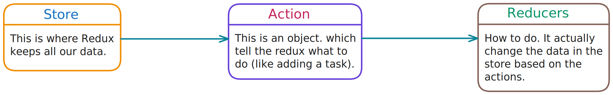
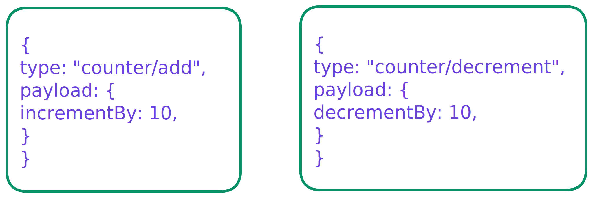
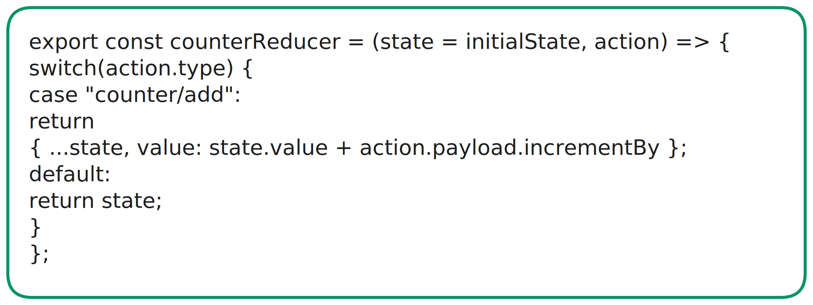

# Redux Guide for Revision

# Table Of Content

1. [Why, When & How to use Redux](#1-why-when--how-to-use-redux-in-react)
2. [Advantages of Redux & Redux Toolkit](#2-what-is-redux-advantages--difference-between-redux--redux-toolkit)
3. [Reducer Function](#3-what-is-reducer-function-in-redux)
4. [Create Redux Store](#4-how-to-create-redux-store)
5. [Action Creators](#5-redux-with-action-creators-means-how-to-create--dispatch-actions)
6. [Connect Redux with React](#6-how-to-connect-redux-with-react)
7. [useSelector Hook](#7-access-redux-state-in-react-using-useselector)
8. [How to Dispatch Actions](#8-how-to-dispatch-actions)
9. [What is React DevTools](#9-what-is-react-devtools)
10. []()
11. []()
12. []()
13. []()
14. []()
15. []()

---

## 1. Why, When & How to use Redux in React?

**Note:** In small apps, we can manage data using React's state like `ContextAPI` or `useReducer` hook. But as the app grows, it becomes tricky to pass data between many components.

Redux solves this problems by creating a **centralized store** that holds all the data. This store can be accessed & updated by any part of the app.

**Redux:** Redux is a toll that helps **manage data** (also known as "state") in large React apps. It allows us to keep all our app's data in a single place, known as the **Redux store**, making it easy to share & update data access different parts of the app.

**Working Of Redux:**



- **Store:** The Redux store is like a big box where all our application's data is kept safe. Everything we do with Redux-wether adding, removing or updating data-goes through this store.

- **Actions:** This is an object, which tells the Redux what to do (like adding a task).



- **Reducers:** How to do. It actually change the data in the state based on the actions.



---

## 2. What is Redux Advantages & difference between Redux & Redux Toolkit?

1. **Centralized State Management:** Redux stores our app's state in one place, making it easiest to manage & access data across components.

2. **Global Access:** Any component can access & update the state without passing props down.

3. **Predictable Updates:** State changes are controlled & predictable using reducers.

4. **DevTools:** Powerful tools for debugging, inspecting state, & replaying actions.

5. **Async Support:** Middleware like Thunk or Saga handles async tasks, keeping the code clean.

---

## 3. What is Reducer function in Redux?

A reducer is a function that decides how the state should change based on the action. The reducer takes the current state and returns a new state.

A key thing to remember:

1. Reducers must always return a new state.
2. They should never modify the odl state directly.

**Syntax:**

```
function reducer (state=initialState, action){}
```

The reducer takes two arguments:

1. State: This is the current state.
2. Action: This tells the reducer what to do. It has a type & something a payload (which is the data.)

**Example:**

```
function reducer (state=initialState, action){
    switch (action.type){
        case "ACTION_TYPE":
            return {...state, data: action.payload};

        default:
            return false;
    }
}
```

We use a switch statement to check the action's type. based on the action type, the reducer updates the state.

**Best Practices:**

```
const ACTION_TYPE : "task/add" // Here is the common syntax const ACTION_TYPE : "stateDomain/Event"

function reducer (state=initialState, action){
    switch (action.type){
        case "ACTION_TYPE":
            return {...state, data: action.payload};

        default:
            return false;
    }
}
```

**Action Types:** Use a combination of the `state domain` (like task) & the `event` (like add), separated by a slash. For example `task/add`.

**Immutable State:** Never directly change the state. Always return a new state object using `...state` to copy the old state.

---

## 4. How to create Redux Store?

The store is where Redux keeps all our app's data. it's like a database for our app, but it's only for managing data in memory (not saving it permanently).

**Syntax:**

```
import {creteStore} from "redux";

const store =createStore(reducer);
```

The createStore method creates the Redux store using a `reducer function` that handles how the state changes in response to actions.

**Dispatch an Action:** `dispatch()` is used to send actions to the Redux store. An action describes what change we want to make to the state (such as adding a task).

**Syntax:**

```
store.dispatch({type: "ACTION_TYPE", payload: data});
```

**getState():** It retrieves the current state of the Redux state. This is useful for accessing the state after it has been updated or to monitor changes.

The getState method is a synchronous function that returns the current state of a Redux application. It includes the entire state of the application, including all the reducers & their respective states.

---

## 5. Redux with Action Creators, means How to Create & Dispatch Actions?

- **Action:** An `action` is an object that tells Redux what we want to do. It must have a type property that describes the action.

- **Action Creator:** An `action creator` is a function that creates an action object. This makes it easier to create actions with different data.

**Syntax:**

```
function actionCreators(data) {
    return { type: "ACTION_TYPE", payload: data };
}
```

---

## 6. How to Connect Redux with React?

To use Redux in a React app, we need to connect Redux's store & actions to React components. This allows components to access the global state & dispatch actions.

- **Step1:** To install react-redux

```
npm i react-redux

bun add react-redux
```

- **Step2:**
  - **Wrap the App with Provider:** Use the Provider component to pass the Redux store to the entire app.

---

## 7. Access Redux State in React using useSelector?

Use the useSelector hook to read data from the Redux store.

**Syntax:**

```
const count = useSelector((state)=>state.property);
```

**Selector function:** We define a selector function that takes the entire Redux store state as an argument & returns the specific piece of data we need.

---

## 8. How to Dispatch actions?

---

## 9. What is React DevTools?

---

## 10.

---
