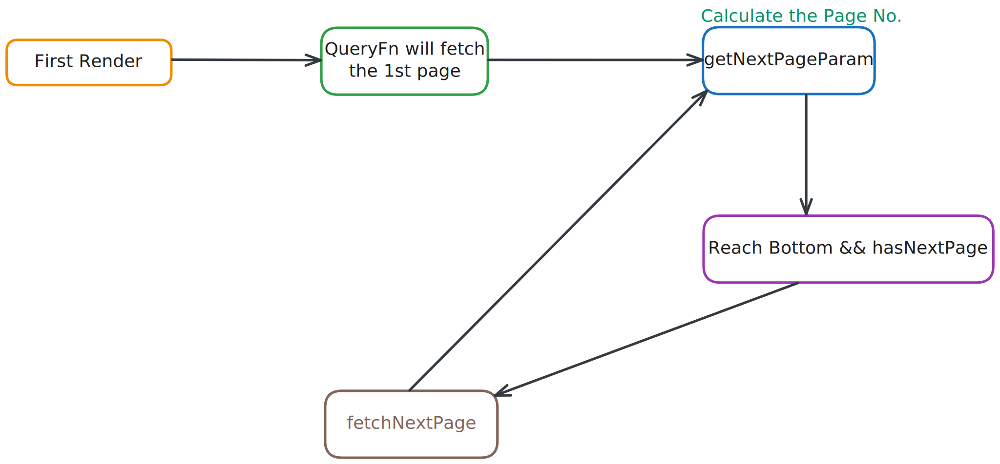

# Tanstack Guide For Revision.

## Table Of Content

1. [Definition](#1-what-is-tanstack-query)
2. [Why learn Tanstack](#2-why-learn-tanstack)
3. [When to Use](#3-when-to-use-tanstack-over-axios-or-redux)
4. [Scenarios where to use](#4-scenario-where-we-use-tanstack)
5. [Advantage](#5-advantages-of-react-query)
6. [Installation Guide](#6-how-to-install-tanstack-query)
7. [QueryClientProvider](#7-how-to-add-queryclientprovider)
8. [useQuery Hook](#8-what-is-usequery-hook)
9. [Handle Loading or Error](#9-how-to-handle-api-loading--errors)
10. [DevTools](#10-how-to-debug-react-query-using-react-query-devtools)
11. [Garbage Collection (gcTime)](#11-what-is-gctime-garbage-collection-time)
12. [Control API Calls](#12-how-to-control-api-calls-or-stop-unwanted-api-calls-using-stale-time)
13. [Polling](#13-how-to-fetch-data-like-real-time-polling-or-constantly-fetch-fresh-data-even-in-background)
14. [Pagination](#14-how-to-create-pagination)
15. [useMutation Hook](#15-what-is-usemutation-hook)
16. [Infinite Scrolling](#16-how-to-get-infinite-scrolling)
17. [Logic Infinite Scroll Using Pure Js](#17-how-to-know-that-user-has-reach-bottom-using-pure-javascript)
18. [Infinite Scroll Using React Intersection Observer](#18-how-to-make-infinite-scroll-feature-with-using-react-intersection-observer)

---

## 1. What is TanStack Query?

It's a library that helps us manage the state of data we fetch from servers, like APIs, in our React Application.

It is one of the most powerful tools for managing server-side state in React.

---

## 2. Why learn TanStack?

React Query (Tanstack Query) simplifies data fetching, caching, and synchronization in our applications, making it easier than ever to manage our data. Whether we're a beginner or an experienced developer, mastering this library can significantly enhance our productivity and improve our app's performance.

---

## 3. When to use Tanstack over axios or redux?

| Feature                         | Axios             | Redux/RTK                                 | TanStack Query                |
| ------------------------------- | ----------------- | ----------------------------------------- | ----------------------------- |
| API Requests                    | ✅                | ✅ (with RTK Query or `createAsyncThunk`) | ✅                            |
| Data Caching                    | ❌                | ❌ (manual)                               | ✅                            |
| Auto Refetch                    | ❌                | ❌                                        | ✅                            |
| Background Sync                 | ❌                | ❌                                        | ✅                            |
| Pagination/Infinite Scroll      | ❌                | ❌                                        | ✅                            |
| Global State (e.g., theme/user) | ❌                | ✅                                        | ❌                            |
| Boilerplate-Free                | ✅                | ❌                                        | ✅                            |
| Ideal For                       | Simple fetch/post | Global state & complex flows              | Server state, read-heavy apps |

**In Short:**

✅ Best Practice in Modern MERN Stack Apps
Use this combo:

- ✅ Axios — for making API requests.

- ✅ TanStack Query — to manage API data (GET, caching, loading).

- ✅ Redux/RTK — only if needed for global UI state or complex non-API logic.

---

## 4. Scenario where we use Tanstack?

- **Over Axios :-**

| Scenario                                                              | Reason                                                    |
| --------------------------------------------------------------------- | --------------------------------------------------------- |
| You want to fetch data (GET) from an API                              | TanStack gives caching, auto refetch, and background sync |
| You want automatic loading/error state management                     | TanStack manages this out of the box                      |
| You want to avoid writing useState/useEffect manually for every fetch | TanStack abstracts that                                   |
| You want pagination/infinite scroll                                   | Built-in support                                          |
| You want to sync server data with UI easily                           | TanStack is built for this                                |

- **Over Redux :-**

| Scenario                                                       | Reason                                |
| -------------------------------------------------------------- | ------------------------------------- |
| You only need to manage **remote/server data** (API responses) | TanStack is made for this             |
| You want to avoid boilerplate of actions/reducers              | TanStack is simpler and declarative   |
| You need background refetch, caching, etc.                     | Redux doesn’t give this automatically |
| You're building a **read-heavy** app (blogs, dashboards, etc.) | TanStack is optimized for reads       |

---

## 5. Advantages of React Query?

- **Data Fetching made Easy :-** With a simple `useQuery` Hook, fetching data becomes super easy.

- **Built-in Loading & Error States :-** No need to write custom code for handling loading, errors, or success states.

- **Automatic Caching :-** React Query automatically caches our data.

- **Background Refetching :-** If our data gets state or out of data, Tanstack Query can refetch in it background.

- **Pagination & Infinite Scrolling :-** Handling pagination or infinite scrolling? React Query has covered with tools specifically designed for those complex use cases.

---

## 6. How to install Tanstack Query?

[Go to Official Website](https://tanstack.com/query/latest/docs/framework/react/installation)

---

## 7. How to add QueryClientProvider?

In React Query, the QueryClientProvider is a crucial component that provides a QueryClient instance to our React application. This QueryClient is responsible for managing all the data fetching., caching, & state management related to our queries.

**What is Query Client?**

**QueryClient:** It is core part of the react-query library. It manages the caching, background fetching, data synchronization, & other query-related logic. It provides a centralized store for managing & caching asynchronous data in our application.

**new QueryClient():** This creates a new QueryClient instance with default settings. We can configure it with options if needed (e.g. setting cache time, state time etc.)

**QueryClientProvider:** This component is part of React Query & is used to provide the QueryClient instance to our entire React app (or a portion of it.). This make the query client available via React's context API so that all the components in the tree can use the useQuery, useMutation, & other hooks provided by React Query.

```
import

// First we make an instance of QueryClient.
const queryClient = new QueryClient()

// & than we pass this queryClient to QueryClientProvider. Inside this all the children are come.
<QueryClientProvider client={queryClient}>
    <RouterProvider router={router}></RouterProvider>
</QueryClientProvider>

```

[For Code Part...](./src/App.jsx)

---

## 8. What is useQuery Hook?

This is used to fetch data. Inside this we have to pass at least 2 arguments or data.

**QueryKey:** The queryKey is typically an array or string that uniquely identifies a query. It allows React Query to determine if the data in the cache is associated with a particular request.

It is used to cache data with a specific key & refetch or update data when certain dependencies change.

```
const {
  data,
  dataUpdatedAt,
  error,
  errorUpdatedAt,
  failureCount,
  failureReason,
  fetchStatus,
  isError,
  isFetched,
  isFetchedAfterMount,
  isFetching,
  isInitialLoading,
  isLoading,
  isLoadingError,
  isPaused,
  isPending, // It is like isLoading state.
  isPlaceholderData,
  isRefetchError,
  isRefetching,
  isStale,
  isSuccess,
  isEnabled,
  promise,
  refetch, // It will run this useQuery(). Whenever this refetch() calls.
  status,
} = useQuery(
  {
    queryKey,
    queryFn,
    gcTime,
    enabled,
    networkMode,
    initialData,
    initialDataUpdatedAt,
    meta,
    notifyOnChangeProps,
    placeholderData,
    queryKeyHashFn,
    refetchInterval,
    refetchIntervalInBackground,
    refetchOnMount,
    refetchOnReconnect,
    refetchOnWindowFocus,
    retry,
    retryOnMount,
    retryDelay,
    select,
    staleTime,
    structuralSharing,
    subscribed,
    throwOnError,
    enabled, // It will by default true.
  },
  queryClient,
)
```

[For Code Part...](./src/Pages/FetchRQ.jsx)

---

## 9. How to Handle API loading & Errors?

[For Code Part...](./src/Pages/FetchRQ.jsx)

---

## 10. How to debug react query using React Query devtools?

[For Installing Go To Official Website](https://tanstack.com/query/v5/docs/framework/react/devtools)

Than go to App.jsx file where we made an instance of React Query.

```
import { ReactQueryDevtools } from '@tanstack/react-query-devtools'

function App() {
  return (
    <QueryClientProvider client={queryClient}>
      {/* The rest of your application */}
      <ReactQueryDevtools initialIsOpen={false} />
    </QueryClientProvider>
  )
}
```

[Guide to use React Query DevTools](https://tanstack.com/query/v5/docs/framework/react/devtools#options)

[For Code Part...](./src/App.jsx)

---

## 11. What is gcTime (Garbage Collection Time)?

In React Query v5, the cacheTime option in React Query has been renamed to gcTime.

When we use React Query to get data, it saves the results in a local cache, This means if we ask for the same data again. React Query will give us the saved data instead of making another API request. The cache updates automatically if the data changes, so we always get the latest information.

**Use Case:** Imagine we're fetching a list of users. If we go back to the same page, React Query will show the saved list from the cache instead of reloading it from the server, making our app faster. If a new user is added, React Query will automatically update the list.

By default, inactive queries are garbage collection after 5 minutes. This means that query is not being used for 5 minutes, the cache for that query will be cleared up.

[For Code Part...](./src/Pages/FetchRQ.jsx)

---

## 12. How to control API calls or stop unwanted API calls using Stale Time?

**staleTime:** In React Query, staleTime is a configuration option that determines how long fetched data is considered fresh before it needs to be re-fetched.

**Here's how it works:**

- **Fresh Data:** When data is initially fetched or updated, it's considered fresh.

- **Stale Data:** After the staleTime duration (specified in milliseconds) elapses, the data is considered stale.

- **Default Value:** The default staleTime is 0, meaning data becomes stale immediately after being fetched. This ensures data is always up-to-date but can lead to frequent refetching.

---

## 13. How to fetch data like Real-Time Polling, or constantly fetch fresh data, even in background?

In React Query, polling refers to the technique of fetching data from an API at regular intervals to keep the UI up-to-date with the latest information. This is especially useful for scenarios where data changes frequently & we want to display real-time updates without requiring the user to manually refresh the page.

- **`refetchInterval` option:** The simplest way to enable polling is to pass the `refetchInterval` option to the `useQuery` hook. This option specifies the interval (in milliseconds) at which React Query should automatically refetch the data.

When we want to fetch the data even in background or we are in another tab.

- **`refetchIntervalInBackground` option** If you want to continue polling even when the component is not mounted, we can use the `refetchIntervalInBackground` option. By default it sets to false, & if we want to refetch data even when we are not int this page than we have to set this to true.

**Note :-** If we already use staleTime property than this will not work or work when the staleTime is over, so make sure either use staleTime or this property.

---

## 14. How to create pagination?

Here we firstly select those API which support pagination, & if the website doesn't support pagination like jsonplaceholder.typicode.com than we restrict the data like here we restrict the post to load only 3 post. & than we apply pagination here we always use `placeholderData` key in useQuery & pass `keepPreviousData`.

**placeholderData:** placeholderData is a TanStack Query option that lets we show some temporary or "placeholder" data while our actual data is loading (especially useful when changing query parameters like page numbers or filters).

- ➡️ **Think of it like this:**

If we're flipping through pages of data (e.g., page 1 → 2 → 3), instead of showing a loading spinner while waiting for new data to load, we can temporarily show the previous page’s data — or any other placeholder — so the UI doesn’t "flicker" or feel empty.

**keepPreviousData:** keepPreviousData is a helper function provided by TanStack. When used as the value of placeholderData, it tells TanStack:

"While fetching new data, keep showing the previous data in the UI until the new data arrives."

So, instead of writing your own placeholder function, you just use this built-in helper.

[For Code Part...](./src/Pages/FetchRQ.jsx)

---

## 15. What is useMutation hook?

The useMutation hook is part of React Query and is used for operations that modify data, like Create, Update, & Delete (CRUD Operations).
In short it is used to modify or send data to a server.

**Syntax:**

```
const mutation useMutation({
  mutationFn: function(),
  // Optional configuration options
})
```

We can provide various configuration options to customize the behavior of the mutation, such as:

- **onSuccess:** A callback function that runs if the mutation is successful.

- **onError:** A callback function that runs if the mutation fails.

- **onSettled:** A callback function that runs regardless of success or failure.

- **mutationKey:** A unique key to identify the mutation in the cache.

**Mutate():** The mutate() function is used to execute the mutation in React Query. The process is the same whether we're:

1. Deleting Data
2. Updating Data
3. Creating new data

When we call .mutate(), it tells React Query to run the mutation function defined inside the useMutation hook. This is needed because the mutation is an action that changes data, unlike queries, which are used to fetch data & are often auto-executed.

**queryClient.setQueryData:** It is used to update the cached data for a specific query. In this case, it's the query with the key ["posts", pageNumber], which likely represents the list of posts on the current page.

**Syntax:**

```
queryClient.setQueryData(queryKey, callbackFn)
```

```
const queryClient =useQueryClient();

const deleteMutation = useMutation({
    mutationFn: (id) => deleteData(id), // Here deleteData(id) it is an api call for deleting particular data.

    // In the below line data & id is from useQuery hook which we make.
    onSuccess: (data, id) => {
      queryClient.setQueryData(["posts", pageNumber], (curPost) => {
        return curPost?.filter((post) => post.id !== id);
      });
    },
  });
```

**useQueryClient:** useQueryClient() is a hook that gives you access to the Query Client, which is TanStack Query's internal "data manager".

**Think of the Query Client as the "brain" behind all queries:**

- It stores all cached data,

- Knows about active queries,

- Lets you manually update or invalidate cached data,

- Gives full control over query behaviors.

**All methods given by useQueryClient():**

| Method                                       | Purpose                          |
| -------------------------------------------- | -------------------------------- |
| `useQueryClient()`                           | Access the query client in React |
| `queryClient.invalidateQueries(['key'])`     | Refetch data by key              |
| `queryClient.setQueryData(['key'], updater)` | Manually update cached data      |
| `queryClient.getQueryData(['key'])`          | Read cached data                 |
| `queryClient.removeQueries(['key'])`         | Remove query from cache          |

1. ✅ Invalidate a query (Refetch the data)

Imagine we updated a user profile and want to refresh the "users" query.

```
const queryClient = useQueryClient();

const handleSave = async () => {
  await updateUserData();

  // Tell TanStack: "Refetch the users data!"
  queryClient.invalidateQueries(['users']);
};
```

2. 🔍 Read cached data without triggering a new fetch

```
const cachedUser = queryClient.getQueryData(['user', userId]);
console.log(cachedUser);
```

Useful when we want to check if data exists before refetching or navigating.

[For Code Part...](./src/Pages/FetchRQ.jsx)

---

## 16. How to get Infinite Scrolling?

For infinite scrolling we use `useInfiniteQuery()` hook. & inside this we have a property `getNextPageParam` so we use this also.

**Syntax:**

```
const {
  fetchNextPage,
  fetchPreviousPage,
  hasNextPage,
  hasPreviousPage,
  isFetchingNextPage,
  isFetchingPreviousPage,
  promise,
  ...result
} = useInfiniteQuery({
  queryKey,
  queryFn: ({ pageParam }) => fetchPage(pageParam),
  initialPageParam: 1,
  ...options,
  getNextPageParam: (lastPage, allPages, lastPageParam, allPageParams) =>
    lastPage.nextCursor,
  getPreviousPageParam: (firstPage, allPages, firstPageParam, allPageParams) =>
    firstPage.prevCursor,
})
```



[For More Go to Official Documentation](https://tanstack.com/query/latest/docs/framework/react/reference/useInfiniteQuery)

[For Code Part...](./src/Pages/InfiniteScroll.jsx)

---

## 17. How to know that user has reach bottom using pure JavaScript?

For this we use Scroll Events.

**`window.innerHeight`:** The height of the visible part of the webpage (the viewport).

**`window.scrollY`:** The amount of pixels the user has scrolled down the page.

**`document.documentElement.scrollHeight`:** The total height of the webpage, including the part which is not visible without scrolling.

When the sum of `window.innerHeight` & `window.scrollY` is approximately equal to `document.documentElement.scrollHeight - 1`, the user is near the bottom of the page.

[For Code Part...](./src/Pages/InfiniteScroll.jsx)

---

## 18. How to make infinite scroll feature with using React Intersection Observer?

[For Installation Go to Official Website](https://www.npmjs.com/package/react-intersection-observer)

Or use this below command:

```
bun i react-intersection-observer
```

Than we use `useInView` hook which will provide object with keys.

```
import { useInView } from "react-intersection-observer";

const Component = () => {
  const { ref, inView, entry } = useInView({
    /* Optional options */
    threshold: 0,
  });

  return (
  // For recognizing the last thing/element on that page we pass this ref which is given by useInView hook, to ensure that this is the last item or element & now you can change inView value to True.
    <div ref={ref}>
      <h2>{`Header inside viewport ${inView}.`}</h2>
    </div>
  );
};
```

In this threshold: 1, means whenever our touch the bottom than inView value is changed into true otherwise it remains false.

[For Code Part...](./src/Pages/InfiniteScroll.jsx)

---
