# Folder Flow & Structure

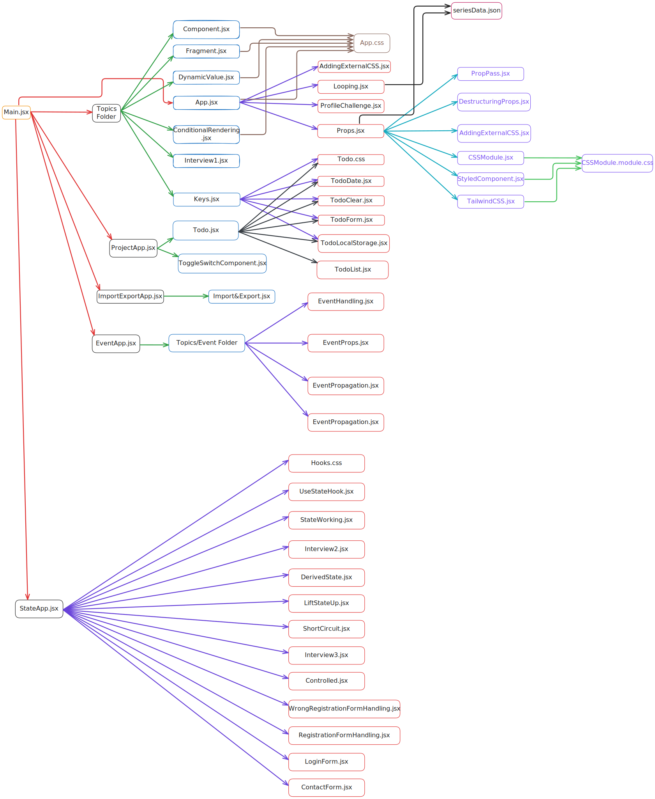

## 1. What is React & Why we use it?

React is a JavaScript library for building user interfaces. It designed to build interactive & efficient UIs by using a component-based declarative approach.

We use it because it makes UI creation fast and efficient using components and virtual DOM.

**Benefits Over Vanilla JS :-**

1. Efficient Updates
2. Reusable Components
3. Declarative Syntax
4. Robust Ecosystem
5. Better Developer Experience

---

## 2. What is Declarative & imperative?

- **Declarative:** Tell "what to do".React is declarative because it describes what the UI should look like rather than how to achieve it.
  This makes the code easier to read and maintain, as it is more focused on the end result rather than the steps involved in getting there.

- **Imperative:** Tell "how to do"

**Example:**
Declarative (React):

```
<button onClick={handleClick}>Click</button>
```

Imperative (vanilla JS):

```
const btn = document.createElement('button');
btn.addEventListener('click', handleClick);
```

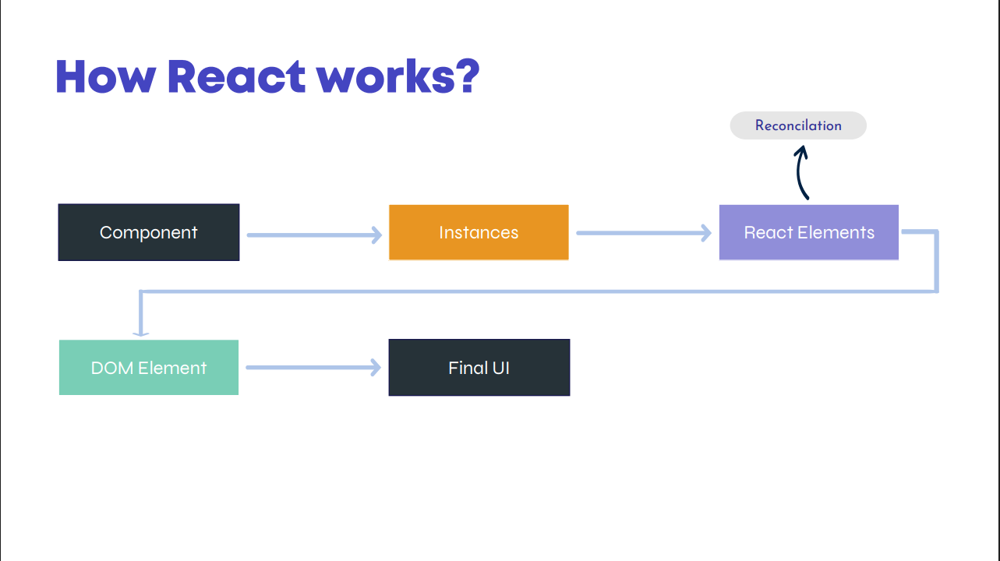

---

## 3. How to make React?

We have to make an element with h1 tag, & inside it we have to write "Hello, Coders", & set some style like background-color: "blue", font-size:"30px", color:"white".

To achieve the above thing we have tow options one with Vanilla JS & the other with React.js.

**Vanilla JavaScript:-**

```
const header1 = document.createElement("h1");
header1.innerText = "Hello, Coders.";
header1.style.backgroundColor = "blue";
header1.style.fontSize = "30px";
header1.style.color = "white";

document.getElementById("root").append(header1);
```

**React:-** Here we have implant React by own, not import it.

```
const React = {
  createElement: function (tag, styles, children) {
    // To create an element.
    const element = document.createElement(tag);

    // To add styles.
    for (let key in styles) {
      element.style[key] = styles[key];
    }

    // If we send array in children.
    if (typeof children === "object") {
      for (let value of children) {
        element.append(value);
      }
    }
    // To add innerText.
    else element.innerText = children;

    // We must return this element.
    return element;
  },
};

const header1 = React.createElement(
  "h1",
  {
    backgroundColor: "blue",
    color: "white",
    fontSize: "30px",
  },
  "Hello Coders"
);
```

When we change in HTML file using DOM than it is known as DOM Manipulation & the process is known as render.

```
const ReactDOM = {
  render: function (element, parent) {
    parent.append(element);
  },
};

const root = document.getElementById("root");
ReactDOM.render(header1, root);
```

---

## 4. What is bundlers, like parcel & vite?

A bundler is a tool that takes our various code files (& sometimes other assets like CSS, image etc.) & combines them into one or more optimized files that can be easily loaded by a browser.

Here's a breakdown of what a bundler does:-

1. Reduce the number of files the browser need to load.
2. Manages & resolves module dependencies.
3. Optimizes & compresses our code for better performance.
4. Keep our code modular & maintainable during development.

Bundlers compile and bundle our project files (JS, CSS, images) for the browser.

- Parcel & Vite are bundlers.

- Vite is faster with hot reload.

---

## 5. What is npm, pnpm, bun, yarn & How to install react & react-dom?

**npm :-** There is no official full form of npm, but people call this as node package manager. it provides access to a huge repository of open-source code libraries. npm makes it easy to install, update & manage dependencies in our project. It comes bundled with node.js, making it a standard tool in JS & web development.

In short "npm is a registry inside it bundler, library & codes are present related to JavaScript."

These all are JavaScript package managers. Here the bun is very faster than all others, than pnpm comes, than npm & at last yarn which is very slow.

```
npm install react react-dom
npm i react react-dom

yarn add react react-dom

pnpm add react react-dom

bun add react react-dom
bun i react react-dom
```

---

## 6. What is Module & Components?

**Module :-** A module is simply a file that contains code-such as functions, objects or classes that can be exported & than imported into other files. This helps keep our code organized & maintainable.

**Component :-** A component in react is self-contained piece of the user interface. It can be a function or a class that return JSX(HTML like syntax) describing what should be rendered on the screen.

In short:-

- Module: A file exporting JS logic.

- Component: A function returning JSX (UI block).

- In React, a component is essentially a JavaScript function or class that returns JSX (JavaScript XML), a
  syntax extension that allows you to write HTML-like code inside JavaScript. Components are the
  building blocks of any React application, allowing for the creation of complex and interactive user
  interfaces through the assembly of isolated, reusable pieces.
- We can also use .js extension with React.js components but it’s recommended to use .jsx to differentiate
  between regular JavaScript Files and React.js components.

There are two ways to create components in React.js:

**Class Based Components :-**

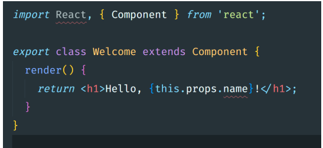

- This is how components were created before functional components.

**Functional Components :-**

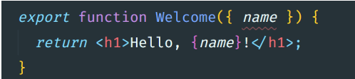

- This is modern and recommended way of writing React.js components.

---

## 7. What is Fragments?

In React.js, a component can’t return multiple elements without a wrapper div.

Fragments let you return multiple elements without an extra DOM node. There are three methods for fragments.

**Method1 :-** Using an Array of Elements with Keys

```
function Fragment1() {
    return [<NetflixSeries key="1" />, <NetflixSeries key="2" />];
}
```

**Method2 :-** Using import { Fragment } from “react”; & return `<Fragment> // </Fragment>.`

```
import React, { Fragment } from "react";

function Fragment1() {

  return (
    <React.Fragment>
      <NetflixSeries />
      <NetflixSeries />
      <NetflixSeries />
      <NetflixSeries />
      <NetflixSeries />
    </React.Fragment>
  );
};
```

**Method3 :-** Shorthand Fragment Notation. <> // </>

```
function Fragment1() {
  return (
    <>
      <NetflixSeries />
      <NetflixSeries />
      <NetflixSeries />
      <NetflixSeries />
      <NetflixSeries />
    </>
  );
}
```

### 7.1 Why can't we return multiple elements at same time?

As after JSX is compiled it is converted to
normal JavaScript object, we can’t return
multiple JavaScript object at the same
time.

```
return ( jsx(…), jsx(…) );
```

As we already know, above code is not
valid JavaScript.

[For Code ...](./Learn-React/src/Topics/Fragment.jsx)

---

## 8. What is JSX?

JSX (JavaScript XML) is a syntax extension to write HTML-like code in JS.

```
const element = <h1>Hello</h1>;
```

---

## 9. How to take any dynamic value like variable, object, function, expressions etc?

Use curly braces {} in JSX.

**Expression :-** JSX allows us to write JavaScript expressions inside curly braces. This includes operations, function calls, & other JavaScript expressions that produce a value.

```
<p>{5 + 3}</p>
<p>{5>3<2}</p>
```

**Variable :-** We can embed any JavaScript variable within JSX by enclosing it in curly braces. The value of the variable will be inserted into the DOM at the respective location.

```
const name = "Dev";

const details = {
    ratings: 9.8,
    language: "Tamil",
};

<p>{name}</p>
<p>{details.ratings}</p>
```

**Function Calls :-** Functions, especially those that return JSX, can be invoked directly within our JSX.

```
const returnGenre = () => {
    const genre = "Action, Thriller, Crime";
    return genre;
}

<p>{returnGenre()}</p>
```

[For Code ...](./Learn-React/src/Topics/DynamicValue.jsx)

---

## 10. How to take conditional values in JSX?

Use ternary or &&.

```
{isLoggedIn ? <p>Welcome</p> : <p>Please login</p>}
{score > 10 && <p>High Score</p>}

return <p>{ age >= 18 ? “Adult” : “Minor” }</p>

return <p>{ age >= 18 && “You can vote” }</p>

return <p>{ username || “Guest” }</p>
```

There are multiples ways to get conditional values. See [Code Part](./Learn-React/src/Topics/ConditionalRendering.jsx)

---

## 11. What is the output of this given JSX?

```
const student=[];
<p>{student.length && "No Student Found"}</p>
```

**Output:** 0 (because 0 && ... returns 0)

[For Code ..](./Learn-React/src/Topics/Interview1.jsx)

---

## 12. How many types we can Export & Import?

1. **Default Export/Import :-** A file can have only one default export.

**Variable Function Export :-** We can't write export default before variable name as we can in function.

```
const Netflix=()=>{
    // Write Code Here, with return value.
    return true;
}

export default Netflix;
```

**Function Export :-**

```
export default function Netflix(){
    // Write code here, with return value.
    return true;
}
```

**Default Import :-** Default Import: When importing a default export, you can name the import whatever you like.

```
import functionName form "./file-path"
import NetFlix form "./file-path"

import otherFunctionName form "./file-path"
```

2. **Named Export/Import :-** A file can have multiple named exports. Each named export must be explicitly exported.

```
export function Netflix(){
    // Write Code here, with return value.
}

export const NetflixCard=()=>{
    // Write code here, with return value.
}
```

**Named Import :-** When importing named exports, the import names must match the export names exactly. Named imports must be enclosed in curly braces.

```
import {fName, f1Name} from "./file-path";
```

1. [For Code on export ...](./Learn-React/src/Topics/Import&Export.jsx)

2. [For Code on import ...](./Learn-React/src/ImportExportApp.jsx)

---

## 13. Looping in JSX, why we use key attribute/prop?

We don’t have for loops in JSX, so we have to use .map() method of arrays.

```
return (
 <ul>
 {students.map((student) => (
 <li key={student}>{student}</li>
 ))}
 </ul>
);
```

- React.js will complain if we don't pass key prop to li.
- React.js uses keys to differentiate each element, so that it can remove or edit correct element when a students gets added or removed.
- We can use Arrays's in JSX too. So here students.map returns array of JSX which gets rendered on the page.

Other Loops can be used outside of JSX, means as an JS format.

Common for all loops & methods.

```
const names = ['Dev', 'Flux'];
const items = [];
```

1. **For Loop, While Loop, Do-While Loop :-**

```
for (let i = 0; i < names.length; i++) {
  items.push(<li key={i}>{names[i]}</li>);
}
return <ul>{items}</ul>;

```

2. **For...of Loop :-**

```
for (let name of names) {
  items.push(<li key={name}>{name}</li>);
}
return <ul>{items}</ul>;
```

3. **ForEach Loop :-** Does not return a value, so not used directly inside JSX. But we can use to prepare data before JSX.

```
names.forEach((name, i) => {
  items.push(<li key={i}>{name}</li>);
});
return <ul>{items}</ul>;
```

4. **Filter()/ Reduce() :-**

- Use filter() to conditionally return a smaller array. Filter + map works well

- Use reduce() to accumulate into a final value. Use if building complex JSX

```
<ul>
  {names.filter(name => name).map((name, i) => <li key={i}>{name}</li>)}
</ul>
```

[For Code ...](./Learn-React/src/Topics/Looping.jsx)

---

## 14. What is Props, & how to use it or pass it in JSX?

Props are inputs to a component. React props (properties) facilitate data transfer from parent to child components.

- Data flows uni-directionally, ensuring a clear direction of information in React applications.
- Props are immutable, meaning child components cannot modify the data received from parents.
- Child components access props through their function parameters.
- We can also pass JSX as props to another component.

```
function Greet(props) {
  return <p>Hello {props.name}</p>;
}

<Greet name="Dev" />
```

1. [For Code Giving Props...](./Learn-React/src/Topics/Props.jsx)

2. [For Code Taking Props...](./Learn-React/src/Topics/PropPass.jsx)

---

## 15. How to destructuring Props?

```
function Profile({ username, age }) {
  return <p>{username} - {age}</p>;
}

<Profile username="DevFlux" age={24}/>
```

[For Code ...](./Learn-React/src/Topics/DestructuringProps.jsx)

---

## 16. How to pass JSX as props, & how to print JSX, which is present inside any property of a component?

```
<ProfileCard
    name="Bob"
    age={25}
    greeting={
      <span>
        <strong>Hello Bob, keep up the great work!</strong>
      </span>
    }
  >
    <p>Hobbies: Gaming, Cooking</p>
    <button>Contact</button>
  </ProfileCard>


// Method1 :-
function ProfileCard(props) {
  return (
    <>
      <h2>Name: {props.name}</h2>
      <p>Age: {props.age}</p>
      <p>{props.greeting}</p>
      <div>{props.children}</div>
    </>
  );
}

// Method2 :-
// function ProfileCard({ name, age, greeting, children }) {

function ProfileCard(props) {
    const { name, age, greeting, children } = props;

  return (
    <>
      <h2>Name: {name}</h2>
      <p>Age: {age}</p>
      <p>{greeting}</p>
      <div>{children}</div>
    </>
  );
}
```

1. [For Code ...](./Learn-React/src/Topics/ProfileChallenge.jsx)

2. 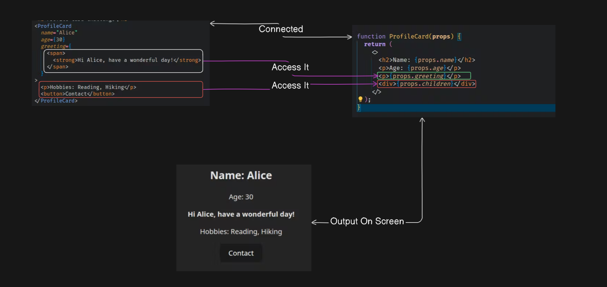

---

## 17. How we can add external CSS to any component?

- You can create files named as \_\_\_\_.css anywhere in your project and import like this:

```
import “./styles.css”
```

- It’s recommended to separate CSS files for each components to make it
  more manageable.
- Use className attribute to apply class names to your JSX element. Instead
  of class, you have to use className attribute.
- For global styles, you can import the CSS file in the index.js or App.js file to
  apply styles globally across the application.

[For Code ...](./Learn-React/src/Topics/AddingExternalCSS.jsx)

---

## 18. How we can add Inline CSS?

We can also use inline styles similar to without React.js.

- Every element accepts a prop called style.
- style={{ backgroundColor: “red” }}
- Unlike normal inline styles, we pass an object to inline styles in JSX.
- All CSS properties are in camel case.
- All CSS values needs to be a string.
- It’s not recommended to use it as it’s not manageable.

```
<p style={{ color: "blue", fontSize: "20px" }}>Hello</p>
```

---

## 19. How we can add conditional styling in inline CSS?

[For Code ...](./Learn-React/src/Topics/AddingExternalCSS.jsx)

---

## 20. What is CSS Modules, & difference between scoped & reusable styles?

**CSS Modules :-**

- Every time you import a CSS file in your react component, they are regarded as global CSS.
- CSS Modules help you keep styles specific to the component they're used in.
- Each module encapsulates its styles, preventing unintended style conflicts with other modules.
- The class names in CSS modules are often automatically generated, reducing the likelihood of naming clashes.

**CSS Module Rules :-**

- Name your CSS module files with the .module.css or .module.scss extension.
- Import the CSS module file in your React component. Access class names as properties of the imported styles object.
- Access class names as properties of the imported styles object.
- Combine multiple class names using template literals or the classnames library.
- Dynamically apply class names based on component state or props.

**CSS Module Important :-**

- When using CSS Modules, class names with hyphens can sometimes cause issues if not accessed correctly. In CSS Modules, you need to use bracket notation for class names with hyphens.

```
<div className={styles['card-content’]}>
```

**Explanation:**

- Using Bracket Notation: In JavaScript, when accessing object properties with special characters (like hyphens), you need to use bracket notation instead of dot notation.
- Dot Notation: styles.card-content will not work because . expects a valid JavaScript identifier, which cannot contain hyphens.
- Bracket Notation: styles['card-content'] correctly accesses the class name from the imported styles object.

---

## 21. What is Styled Component?

A CSS-in-JS library to write CSS inside components.

[Install Styled Component](./Learn-React/Installing-Guide.md)

1. **Using Template Literals :-**

```
const Button = styled.button`
 color: grey;
 background-color: #222;
`;
```

2. **Using style object :-**

```
const Button = styled.button({
 color: grey,
 backgroundColor: "#222",
});
```

- This is a styled component, which is a React component created using styled-components. It is both a React component and a styled component. As a React component, it can be used in JSX. As a styled component, it has styles directly attached to it.
- styled is an object provided by the library, and button is a method on that object.

---

## 22. How to apply Tailwind CSS in JSX?

[Installing Tailwind CSS](./Learn-React/Installing-Guide.md)

To apply Tailwind CSS add classes directly to elements. But here class is a reserved keyword in JS, so we use className instead of class.

[For Code ...](./Learn-React/src/Topics/TailwindCSS.jsx)

---

## 23. What is Event Handling?

Event handling in React.js is the process of capturing & responding to user interactions, such as clicks, keystrokes, or form submission, within a React application. Event handling in React follows a similar pattern to standard JavaScript event handling but with some key differences, such as using synthetic events for cross-browser compatibility & providing consistent event handling across different elements & browsers.

#### 23.1 What is syntheticBaseEvent in React?

When we handle events in React, like clicking a button or typing in an input box, React wraps the native browser events in something called a SyntheticEvent. This SyntheticEvent is a cross-browser wrapper around the browser's native event, making sure that events behave consistently across all browsers.

Here are some widely used React.js events:

1. **onClick**: Triggered when an element is clicked.
2. **onChange:** Triggered when the value of an input element changes.
3. \*\*onSubmit: Triggered when a form is submitted.
4. **onMouseEnter:** Triggered when the mouse pointer enters an element.
5. **onMouseLeave:** Triggered when the mouse pointer leaves an element.
6. **onKeyDown:** Triggered when a key is pressed down.
7. **onKeyUp:** Triggered when a key is released.
8. **onFocus**: Triggered when an element receives focus.
9. **onBlur:** Triggered when an element loses focus.
10. **onInput:** Triggered when the value of an input element is changed (similar to onChange).

- **Event Naming Conventions :-**

**CamelCase:** Event names in JSX should be written in camelCase.

For example, onClick, onChange, onSubmit.

**Prefix with 'on':** Event handlers should be prefixed with "on".

For example, onClick, onMouseEnter.

- **Function Naming Conventions :-**

**Prefix with 'handle':** It is a common convention to prefix event handler functions with "handle" to clearly indicate their purpose.

For example, handleClick, handleChange, handleSubmit.

**Descriptive Names:** Function names should be descriptive and reflect what the function does. For example, handleFormSubmit instead of just handleSubmit if it's specifically for form submission.

[For Code ...](./Learn-React/src/Topics/Event/EventHandling.jsx)

---

## 24. How to pass Events as props?

Passing event handlers as props in React.js is a common pattern used to allow child components to communicate with parent components. This pattern is useful in various scenarios, including:

- **Form Handling:** Passing event handlers like onChange or onSubmit to form components allows the child components to update the form data and notify the parent component of changes.

- **User Interaction:** Event handlers like onClick can be passed to interactive elements (e.g., buttons, links) to trigger specific actions in the parent component, such as opening a modal or navigating to a different page.

- **State Management:** Event handlers can be used to update state in the parent component, which can then be passed down to child components as props to reflect the updated state.

- **Callback Functions:** Event handlers can be used as callback functions to handle asynchronous operations or to update state based on the result of an operation.

```
function WelcomeUser({ onClick }){
 return <button onClick={onClick}>Click me</button>
}

<WelcomeUser onClick={() => alert(“Clicked”)} />
```

- Convention is to start with “on”
- Instead of onClick here, you can also name it onButtonClick, name doesn’t matter.
- Passing functions to another component is not just for events but you can pass any functions you want to other component as props.

[For Code ...](./Learn-React/src/Topics/Event/EventProps.jsx)

---

## 25. Event Propagation in React?

- In React.js, event propagation refers to the process by which events propagate or "bubble" up from the target element through its parent elements in the DOM hierarchy. React follows the same event propagation model as regular JavaScript DOM events.
- When an event occurs on an element in a React component, such as a button click, the event is first captured at the target element and then bubbles up through the parent elements, triggering any event handlers that have been defined along the way. This allows you to handle events at different levels of the component hierarchy.
- React provides a way to stop event propagation using the stopPropagation() method, which can be called on the event object within an event handler. This method prevents the event from bubbling up further in the DOM, ensuring that only the event handler on the target element is triggered.

[For Code ...](./Learn-React/src/Topics/Event/EventPropagation.jsx)

---

## 26. What is React State & useState Hook?

- In React, state refers to an object that holds data or information about the component. State is managed within the component (just like variables declared in a function). However, unlike regular variables, when state changes, React re-renders the component to reflect these changes, keeping the user interface in sync with the data.
- State is dynamic and mutable, meaning it can change over time, usually in response to user actions, server responses, or other events.

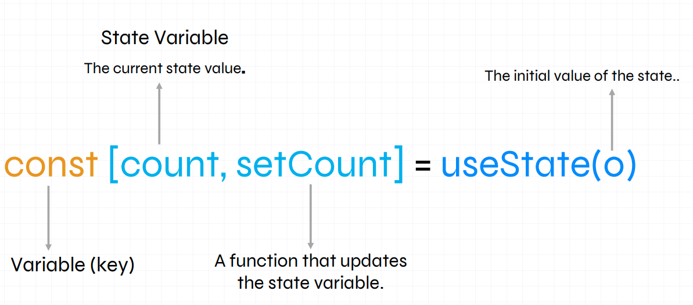

[For Code ...](./Learn-React/src/Topics/Hooks/UseState/UseStateHook.jsx)

**Important Points :-**

- Functions passed to useState() and setState() runs twice during development mode to prevent developers from running side effects.
- Side effects in programming refer to changes or interactions that occur outside the scope of a function or block of code.
- React.js compares previous state and new state using Object.is(), if it finds both are same then it will ignore re-rendering.
- React.js batches all setStates() inside a event handlers and run them at the same time. So, if you try to access the value immediately after setting a state, then you will get old value as it’s asynchronous.

---

## 27. Why we need state in React?

1. Dynamic UI Updates: State allows your components to update dynamically in response to user input or other events. For example, in a form, the state might hold the current value of the input fields, updating in real-time as the user types.

2. Interactivity: State makes your application interactive. By maintaining state, you can create components that respond to user actions, such as clicks, form submissions, or keyboard inputs.

3. Data Management: State helps manage data within a component. For instance, you can fetch data from an API and store it in the state, which will then be used to render the UI.

4. Component Communication: State can be lifted up to parent components to manage shared state across multiple child components, ensuring consistent data flow and synchronization.

---

## 28. How React State Works?

In React, state is a way to store and manage data that can change over the lifetime of a component. When state changes, React re-renders the component to reflect the new state. This ensures that the user interface stays in sync with the underlying data.

**Using useState in Function Components :-**

- Initialization: You call useState with the initial state value. It returns an array with two elements: the current state value and a function to update that state.
- Updating State: When you call the updater function, React schedules a re-render of the component with the new state value.
- Preservation of State: React maintains state between renders. When a component re-renders, it doesn't reinitialize the state. Instead, it uses the preserved state from the previous render.

[For Code ...](./Learn-React/src/Topics/Hooks/StateWorking.jsx)

---

## 29. What is Reconciliation & virtual DOM?

**Virtual DOM :-** The virtual DOM (VDOM) is a programming concept where an ideal, or "virtual", representation of a UI is kept in memory & synced with the "real" DOM by a library such as ReactDOM. THis process is called Reconciliation.

**Reconciliation :-** React Reconciliation is the process through which React updates the Browser DOM.

**The Diffing Algorithm :-** Diffing short for differences algorithm is used to differentiate the DOM tree for different updates.

---

## 30. Why Virtual DOM term is misleading?

- React can render to various environments, including the DOM, native iOS, and Android views via React Native.
- The term "virtual DOM" is a bit misleading because React's reconciler and renderer are separate phases.
- Reconciliation is the process of computing changes in a tree, while rendering is the actual update of the rendered app.
- React DOM and React Native can have their own renderers but share the same reconciler from React core.
- This separation allows React to efficiently update different rendering targets.

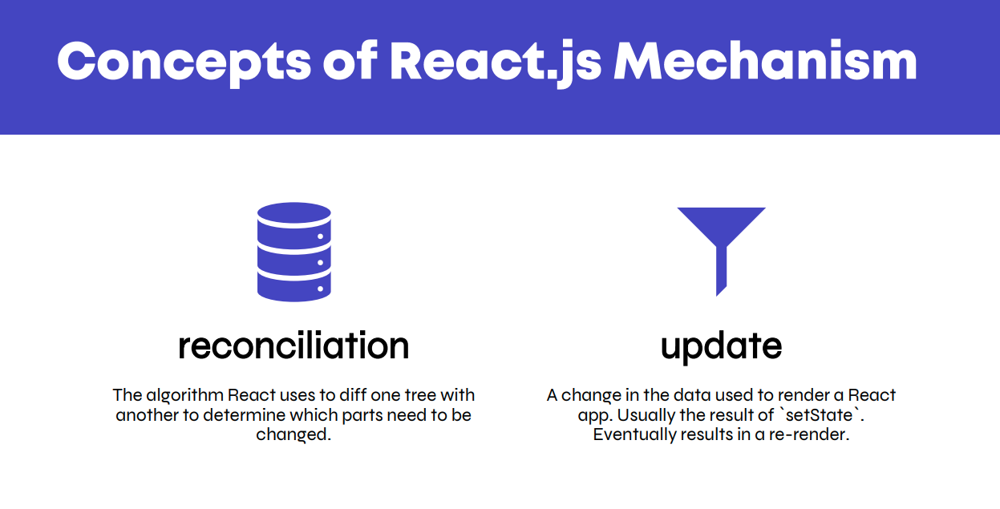

#### How React State Works?

- Read React.js 2025 PDF from page no. 95-100.

[PDF Link](./React.js%202025%20Course%20Full%20Notes.pdf)

---

## 31. What is Derived State?

Derived state is any state that can be computed based on other state or props. It is not stored directly in the component's state but is calculated when needed. This approach helps avoid duplication and keeps the state simpler and more manageable.

`Ex: const userCount = users.length;`

**Benefits of Derived State :-**

- Avoid Redundancy: By deriving values from existing state, you avoid storing redundant data.
- Consistency: Ensures that derived values are always in sync with the underlying state or props.
- Simplicity: Reduces the complexity of state management by minimizing the number of state variables.

[For Code...](./Learn-React/src/Topics/Hooks/DerivedState.jsx)

---

## 32. What is lift state up in React?

Read PDF page no. 103-109.

[PDF Link](./React.js%202025%20Course%20Full%20Notes.pdf)

---

## 33. Why keys are important in React.js?

- A string or a number that uniquely identifies it among other items in that array.

- Keys tell React which array item each component corresponds to, so that it can match them up later. This becomes important if our array items can move ( e.g. dur to sorting), get inserted, or get deleted.

- **Rules :-**

1. Keys must be unique among siblings.

2. Keys must not change.

[For Code File ...](./Learn-React/src/Topics/Keys.jsx)

[For PDF ...](./React.js%202025%20Course%20Full%20Notes.pdf) Page No. 126-139

---

## 34. What is Short Circuit Evaluation?

Short circuit evaluation is a technique used in JavaScript (and many other programming languages) where expressions are evaluated from left to right. In logical operations, evaluation stops as soon as the result is determined. This is often used in React to conditionally render components or execute code based on the truthiness of certain conditions.

**Rules of Short Circuit Evaluation :-**

Short circuit evaluation involves logical operators (&&, ||, ??) and how they evaluate expressions based on the truthiness of their operands.

1. **Logical OR (||)**

Syntax: expression1 || expression2

Rule: If expression1 is truthy, return expression1. Otherwise, return expression2.

```
const result = false || 'Hello'; // 'Hello'
const result2 = true || 'World'; // true
```

2. **Logical AND (&&)**

Syntax: expression1 && expression2

Rule: If expression1 is falsy, return expression1. Otherwise, return expression2.

```
const result = true && 'Hello'; // 'Hello'
const result2 = false && 'World'; // false
```

3. **Nullish Coalescing (??)**

Syntax: expression1 ?? expression2

Rule: If expression1 is not null or undefined, return expression1. Otherwise, return
expression2.

```
const result = null ?? 'Hello'; // 'Hello'
const result2 = undefined ?? 'World'; // 'World'
const result3 = '' ?? 'Fallback'; // ''
```

[For Code ...](./Learn-React/src/Topics/Hooks/ShortCircuit.jsx)

---

## 35. What are React Hook Rules?

- Hooks let you use different React features from your components.
- It starts with use\_\_\_\_. (useState, useEffects, useReducer)
- Hooks can only be used at the top level of your component.
- Do not call Hooks inside loops, conditions, or nested functions.
- Call Hooks only from React function components or custom Hook. Do not call Hooks from regular JavaScript functions or in Class components.
- You can also create your own custom hooks by creating functions starting with use\_\_\_\_. This ensures that React can identify it as a Hook. (ex. useFetch, useForm)
- Ensure Hooks are Called in the Same Order. This allows React to properly preserve the state of Hooks between re-renders.

[For Code ...](./Learn-React/src/Topics/Hooks/ShortCircuit.jsx)

---

## 36. What is Controlled & Uncontrolled components?

- A component is “controlled” when the important information in it is driven by props rather than its own local state.
- Meanwhile uncontrolled components are components in which its important information is driven by its own local state.
- In practice, “controlled” and “uncontrolled” aren’t strict technical terms.
- They can be used in multiple cases.

**Controlled COmponent :-**

Controlled components in React are those where form data is handled by React component state.

This means:

- State Management: The value of the input field is controlled by React state (useState or this.state in class components).
- Event Handlers: Changes to the input field (like typing into a text field) are handled by React event handlers (onChange, onBlur, etc.).
- State Updates: When the user interacts with the form input, React state is updated through event handlers, and the input value reflects the current state value.

**Pros:**

- React has complete control over the input values, making it straightforward to implement features like validation and conditional formatting based on state.
- Easier to handle form submission and integration with React's lifecycle methods.
- Enables clear data flow and centralized state management within React components.

**Cons:**

- Requires more code compared to uncontrolled components due to state management.
- Can lead to more re-renders if not optimized, although React handles this efficiently in most cases.

**Uncontrolled Component :-**

Uncontrolled components in React are those where form data is handled by the DOM itself.

This means:

- Direct DOM Manipulation: The value of the input field is controlled by the DOM (document.getElementById, etc.). It’s not declarative way right.
- Event Handling: Changes are directly handled by DOM events (onchange, onblur, etc.).
- Accessing Form Data: Form data is accessed through refs or DOM traversal methods, not through React state.

[For Code ...](./Learn-React/src/Topics/Hooks/UseState/Controlled.jsx)

---

## 37. What is useEffect() Hook?

The useEffect hook in React is used for handling side effects in functional components.

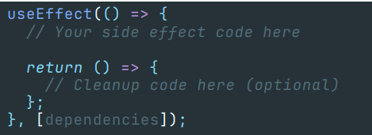

1. Initial Render: When the component mounts, useEffect can run its effect function to perform operations like data fetching.
2. Dependencies: The second argument, an array of dependencies, which determines when the effect should re-run. If any value in this array changes, the effect will re-run.
3. Cleanup: useEffect can return a cleanup function to clean up after the effect, such as unsubscribing from an event or clearing a timer.

A side effect is any operation that affects something outside the scope of a function (Pure function). In React, side effects are managed using hooks like useEffect to ensure they are handled in a controlled and predictable manner.

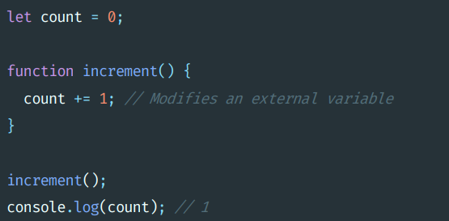

Fetching Data as a Side Effect When you fetch data in a React component, you're performing a side effect because:

**External Interaction:** You're interacting with an external data source, such as an API or a server.

**State Updates:** The fetched data will usually update the component's state, causing a re-render.
Others ….

- Subscribing to or unsubscribing from a service.
- Updating the browser's DOM.
- Logging data to the console

[For Code ...](./Learn-React/src/Topics/Hooks/UseEffect/UseEffectHook.jsx)

---

## 38. What is useRef() Hook?

- useRef is a React Hook that lets you reference a value that’s not needed for rendering.
- Unlike states, it’s directly mutable.
- You can access value of it’s using yourRef.current;

**Uncontrolled Components:**

- Uncontrolled components manage their own state internally and are typically used with
  refs.

[For Code ...](./Learn-React/src/Topics/Hooks/)

---

## 39. What is forwardRef()?

React forwardRef allows parent components to move down (or “forward”) refs to their children. It gives a child component a reference to DOM entity created by its parent component in React. This helps the child to read and modify the element from any location where it is used.

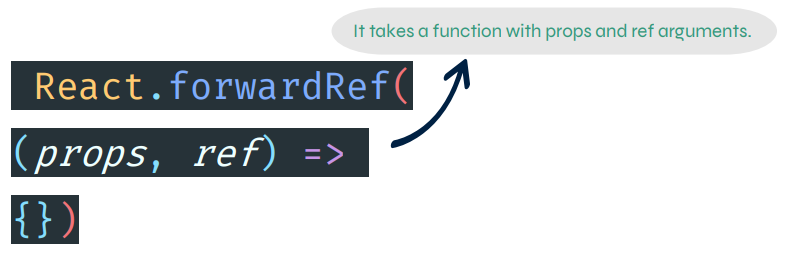

---

## 40. WHat is useId()?

useId is a React Hook for generating unique IDs that can be passed to accessibility attributes. It helps to ensure that each instance of a component gets a unique ID, which is useful for associating labels with input fields and other elements

**Syntax:**

```
const id = useId()
```

**Parameters:** useId does not take any parameters.

**Returns:** useId returns a unique ID string associated with this particular useId call in this particular component.

**Note:** useId should not be used to generate keys in a list.

[For Code ...](./Learn-React/src/Topics/Hooks/)

---

## 41. What is useReducer()?

```
const [state, dispatch] = useReducer(reducer, initialState);
```

It returns an array containing the current state and a dispatch function.

**Dispatch function:** Dispatch function is used to send actions to the reducer, which in turn updates the state based on the action's type and any associated data (payload).

**Reducer Function:** A function that takes the current state and an action as arguments, and returns a new state.

**Initial State:** The initial state value. (The initial state can be a simple value, an object, or even derived from a function if the initialization is complex.)

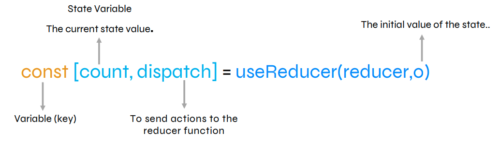

[For Code ...](./Learn-React/src/Topics/Hooks/)

---

## 42. WHat is React.memo()?

- The React.memo function is used for memoization of functional components.
- If the props of a memoized component have not changed, React skips the rendering for that component, using the cached result instead.
- Do memoization only when necessary.

OR

React.memo() is a higher-order component that we can use to wrap components that we do not want to re-render unless props within them change

[For Code ...](./Learn-React/src/Topics/Hooks/)

---

## 43. What is useMemo() Hook?

```
const memoizedValue = useMemo( () => {
  // Your computation logic here
  return computedValue;
}, [dependencies]);
```

- useMemo is a React Hook used for memoization.
- Memoization is a technique to optimize performance by caching the results of expensive function calls.
- Use it when you want to prevent unnecessary re-execution of a function on every render.
- Useful for optimizing performance in situations where calculations or operations are computationally expensive.
- Overusing useMemo might lead to unnecessary complexity and impact readability.

[For Code ...](./Learn-React/src/Topics/Hooks/)

---

## 44. What is useCallback() Hook?

- useCallback is a React hook used to memoize functions, preventing unnecessary re-creation of functions on each render.
- Useful for optimizing performance in scenarios where a function is passed as a prop to child components, preventing unnecessary re-renders.
- Helps in avoiding re-renders of child components when the parent component rerenders but the function reference remains the same.

[For Code ...](./Learn-React/src/Topics/Hooks/)

---

## 45. What is Controlled form input vs Uncontrolled form input?

**Controlled input :-**

- In a controlled input, the form data is controlled by the React component state.
- The input field's value is bound to the state, and any changes to the input trigger a state update.
- Typically, you use the onChange event to handle input changes and update the state accordingly.

**Uncontrolled input :-**

- In an uncontrolled input, the form data is not directly managed by React state.
- The DOM handles the input's value, and React doesn't necessarily know or control it explicitly.
- Refs are often used to interact with the DOM element directly.

---

## 46. What is the difference between useCallback(), useMemo() & React.memo()?

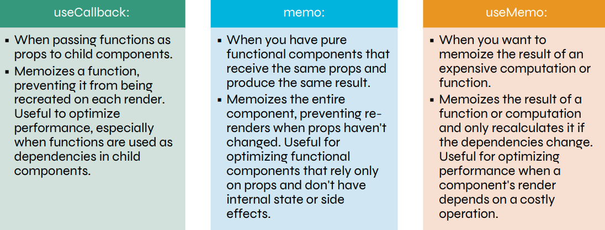

---

## 47.

---

## 48.

---

## 49.

---
